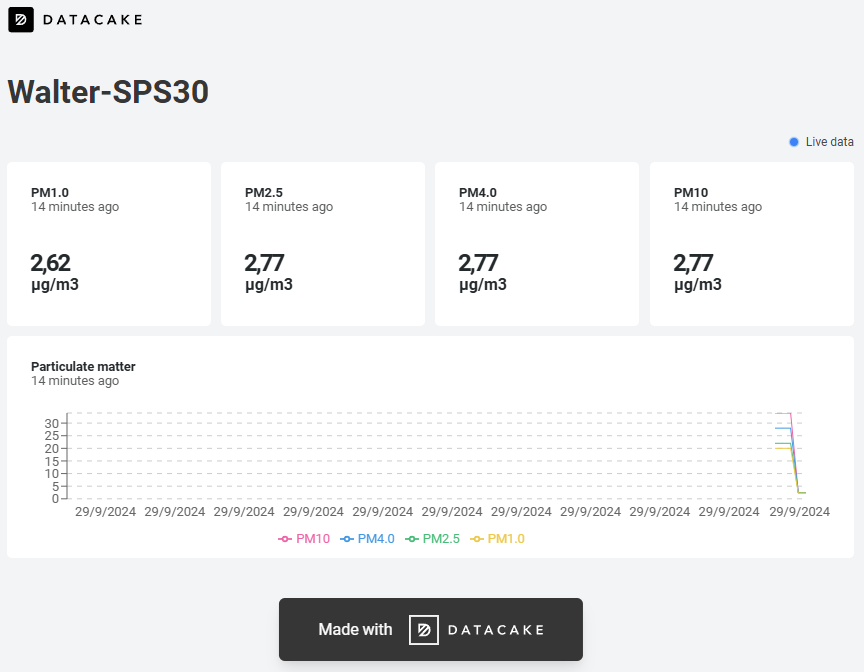

# Sensirion SPS30 + Quickspot Walter to Datacake

## Introduction

This repository is a 'quick and dirty' implementation of a Sensirion SPS30
particulate matter sensor connected to a QuickSpot Walter module. The Walter 
module uploads data to the Datacake platform through HTTPS.

